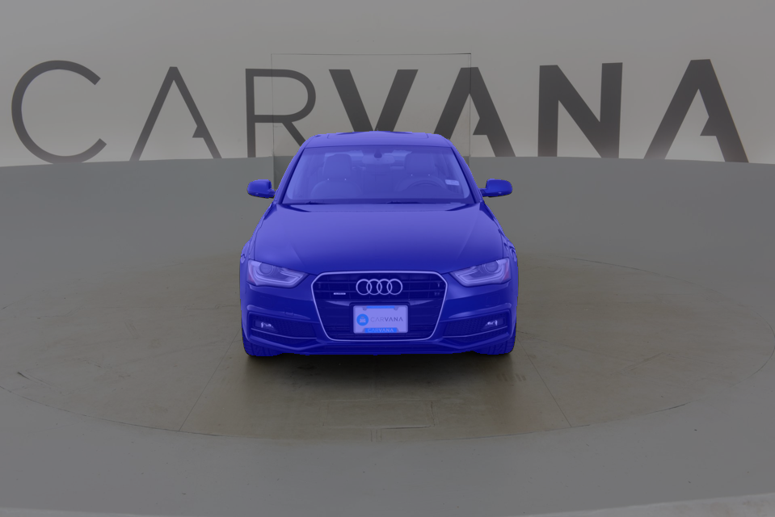

# UNet PyTorch - COVID CT Segmentation

This repository implements a UNet for semantic segmentation, adapted for the COVID CT Scans dataset with `.npy` images and masks.

 [](https://github.com/yakhyo/unet-pytorch)

<table>
  <tr>
    <td style="text-align: center;">
      <p>Input image</p>
      
    </td>
    <td style="text-align: center;">
      <p>Predicted mask</p>
      
    </td>
    <td style="text-align: center;">
      <p>Image and mask overlay</p>
      
    </td>
  </tr>
</table>

## Dataset Preparation

- Place your COVID CT images and masks as `.npy` files in separate directories.
- Each image and its corresponding mask must have the same filename (e.g., `case_001.npy` in both folders).

Example directory structure:
```
data/
  imgs/
    case_001.npy
    case_002.npy
    ...
  masks/
    case_001.npy
    case_002.npy
    ...
```

**Ensure dataset consistency:**  
You can check and clean unmatched files using:
```sh
python check_dataset_consistency.py --images_dir data/imgs --masks_dir data/masks --clean
```
To also clean split files (e.g., for cross-validation), use:
```sh
python check_dataset_consistency.py --images_dir data/imgs --masks_dir data/masks --clean_splits
```
This will remove entries from split files that do not exist in both images and masks directories.

## Visualize Samples

To visualize random samples and their masks (with optional overlay):
```sh
python visualize_covid_ct.py --images_dir data/imgs --masks_dir data/masks --num_samples 4 --overlay
```

## Training

To train the UNet on the COVID CT dataset:
```sh
python train.py --images_dir data/imgs --masks_dir data/masks --batch-size 4 --epochs 10
```
- The model expects single-channel CT images in `.npy` format.
- All training parameters can be set via command-line arguments (see `python train.py --help`).
- **Cross-validation:** The code supports 5-fold cross-validation using split files (`train_new0.txt`, ..., `train_new4.txt` and `valid_new0.txt`, ..., `valid_new4.txt`).  
  During training, any missing or unmatched files in the splits are automatically filtered out for safety.

- **TensorBoard Logging:**  
  Training and validation metrics for each fold are logged to TensorBoard in a directory named with the fold number and the current date/time (format: `runs_fold{fold}_mm_dd_yy-hh_mm_ss`).

## Model

- The UNet model is configured for single-channel (grayscale) input.
- The number of output classes can be set with `--num-classes` (default: 2).

## Requirements

- Python 3.7+
- PyTorch
- numpy
- tqdm
- torchsummary
- matplotlib
- PIL

Install requirements:
```sh
pip install -r requirements.txt
```

## Notes

- The code no longer uses the Carvana dataset or image formats.
- All data loading, visualization, and training are adapted for `.npy` files from the COVID CT dataset.
- For best results, ensure all images and masks are preprocessed and matched as described above.
- **Safety net:** During training, only samples present in both images and masks directories are used, even if split files contain extra or missing entries.
